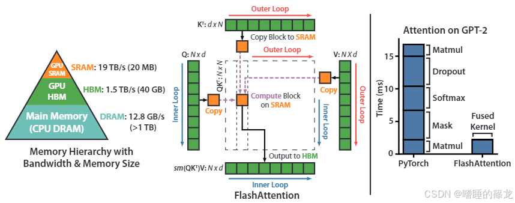
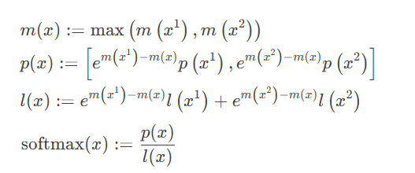

# Flash Attention

#### 1. 为什么  
传统注意力机制在计算时，频繁读写HBM（显存），导致大量内存访问开销（O(N²)），成为训练/推理瓶颈。  

#### 2. 怎么做  
算法优化：通过分块（Tiling）和重计算，将计算拆分为小块，在SRAM（高速缓存）中完成，减少HBM访问。  
硬件协同：利用GPU层级存储（SRAM→寄存器→HBM），提升IO效率。  

#### **3. 解决的问题**  
速度：显著降低计算耗时（如BERT训练提速3×）。  
内存：显存占用从O(N²)降至O(N)，支持更长序列。  
扩展性：为后续大模型（如GPT-4）的高效注意力计算奠定基础。  

---

### **1. 分块Softmax的简化场景（假设无溢出）**
如果完全忽略数值稳定性（比如假设使用无限精度的数学运算），Softmax的分块计算可以简化为以下步骤：

1. **分块计算局部和**  
   将输入矩阵 \( S \) 分成块 \( S_{ij} \)，对每个块计算：
   \[
   \text{局部分子}_i = \sum_{j} e^{S_{ij}}, \quad \text{局部分母} = \sum_{i,j} e^{S_{ij}}
   \]
2. **合并结果**  
   最终Softmax结果为各块结果的加权组合。

**此时确实非常简单**，因为无需处理跨块的数值稳定性问题。

---

### **2. 实际难点：数值稳定性 + 数学等价性 + 硬件约束**
Flash Attention的难点在于要同时满足以下条件：

#### （1）**数值稳定性（Safe）**
- **问题**：FP16的数值范围有限（最大~65504），直接计算 \( e^{S_{ij}} \) 容易溢出。
- **解决**：必须引入**全局最大值减（Max Subtraction）**：
  \[
  \text{StableSoftmax}(x_i) = \frac{e^{x_i - m}}{\sum_j e^{x_j - m}}, \quad m = \max(x_1, ..., x_N)
  \]
  - 但分块时无法预先知道全局最大值 \( m \)。

#### （2）**数学等价性**
- **要求**：分块结果必须与完整Softmax**严格数学等价**，不能近似。
- **挑战**：需要设计递推公式来维护跨块的全局统计量（如最大值、求和）。

#### （3）**硬件效率**
- **约束**：分块大小必须适配GPU共享内存（SRAM）容量，且尽量减少高延迟显存（HBM）访问。

---

### **3. Flash Attention的解决方案**
通过以下数学技巧解决上述问题：

维护两个跨块递推变量：
- **块间最大值** \( m^{(l)} = \max(m^{(l-1)}, \text{当前块最大值}) \)
- **带修正的求和** \( \ell^{(l)} = e^{m^{(l-1)} - m^{(l)}} \ell^{(l-1)} + \text{当前块求和} \)

- 每个块只需维护 \( O(1) \) 的中间变量（\( m^{(l)}, \ell^{(l)} \)），不依赖全局数据。
- 计算与内存访问模式完美匹配GPU架构。

- **“Safe”是核心创新点**，它使得分块计算在满足硬件效率的同时，不牺牲数值精度和数学正确性。

- 单纯分块计算Softmax本身并不难，难的是在**有限精度（FP16）**和**硬件约束**下，实现与标准Softmax**数学等价**的高效计算。
